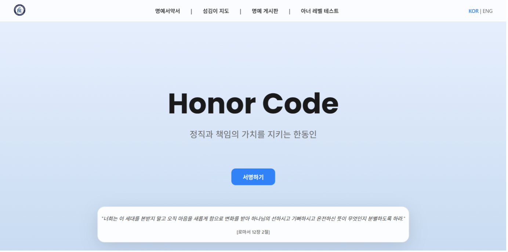
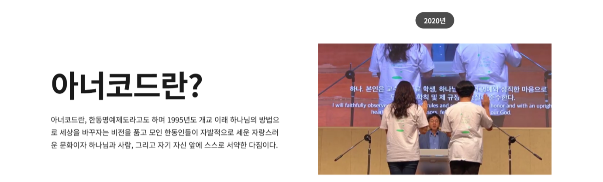
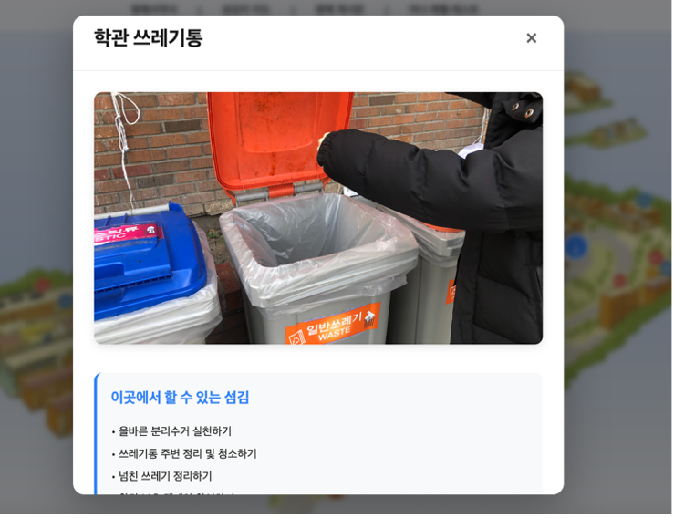
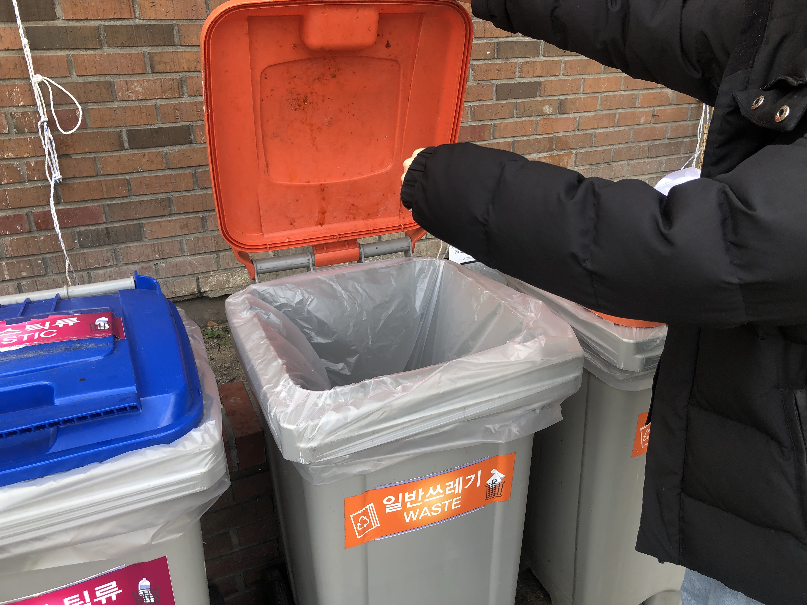
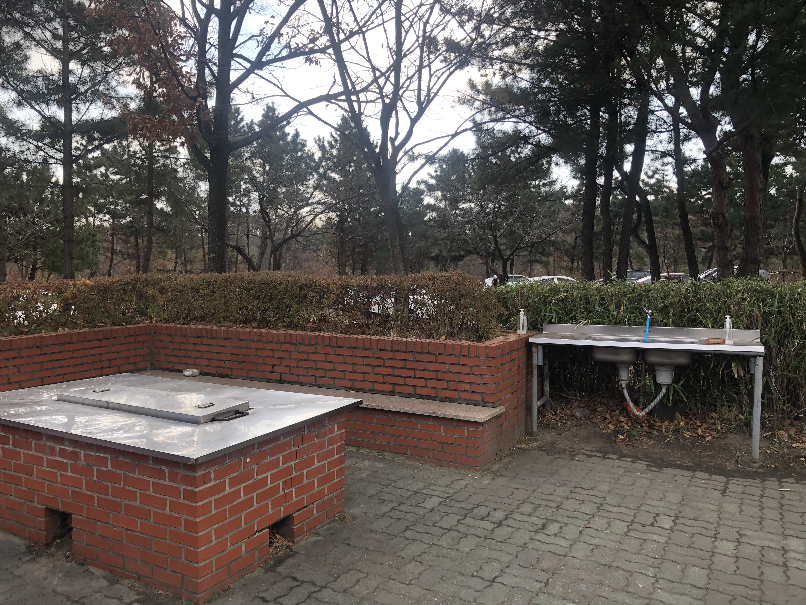
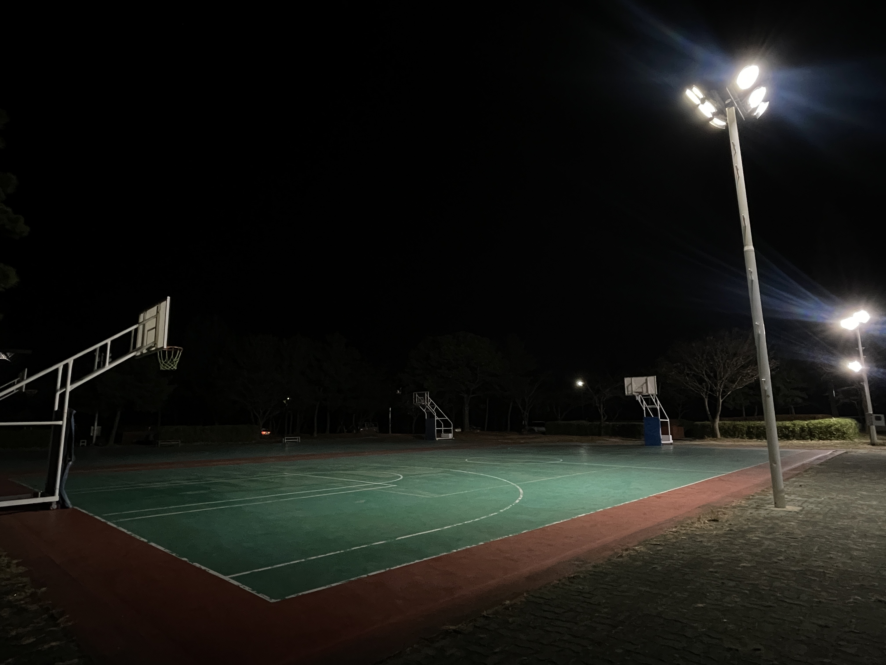
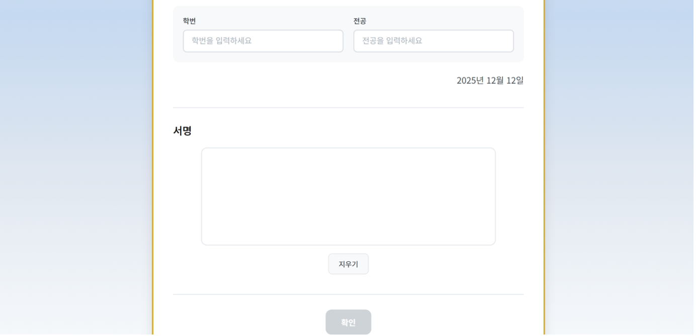
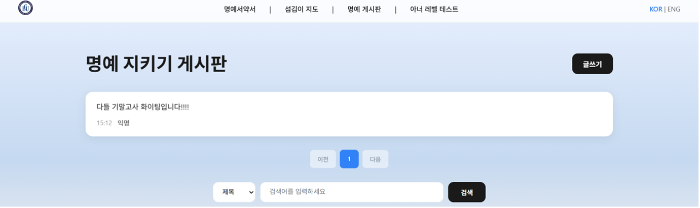
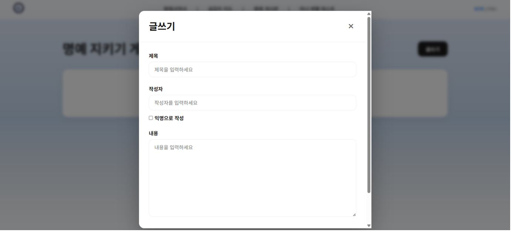
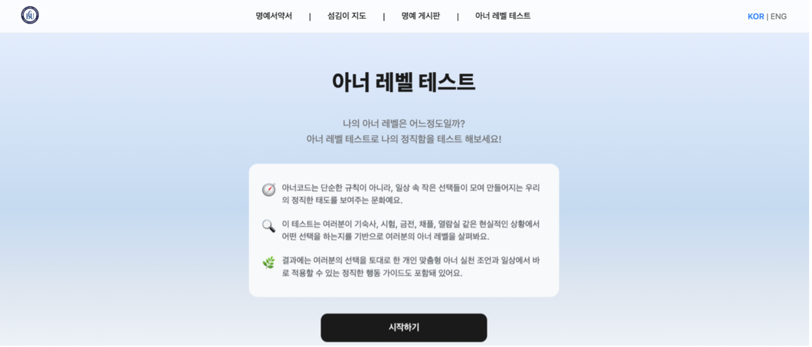

# 2025 Honor Code Web

### 아너코드 웹 페이지 설계 및 구현 보고서
> **학생 참여 중심의 아너코드 실천 경험 공유 및 소통 플랫폼**

- **제출자**: 22100311 박진우, 22100750 최정현, 22400133 김예진, 22500609 장애서
- **제출일**: 2025. 12. 20

---

한동대학교 **Honor Code(아너코드)** 문화를 소개하고, **서약/체험/공유**를 웹에서 직접 해볼 수 있도록 만든 **순수 프론트엔드(Vanilla JS) 기반 인터랙티브 웹사이트**입니다.

## 배포 링크 (Netlify)

이 프로젝트는 Netlify에 배포되어 운영 중입니다. 아래 링크에서 바로 확인할 수 있습니다.

👉 **[https://shimmering-panda-0778ef.netlify.app/](https://shimmering-panda-0778ef.netlify.app/)**

> **참고**: 이 저장소의 파일들은 Netlify에 그대로 업로드되어 호스팅되는 구조입니다. 별도의 빌드 과정이나 로컬 서버 설정 없이 정적 파일 호스팅으로 동작합니다.

## 프로젝트 한눈에 보기


- **목표**: 아너코드(정직·책임)의 가치를 “읽는 것”을 넘어 **직접 참여(서명/테스트/게시/섬김 안내)**로 경험하게 만들기
- **형태**: HTML/CSS/JavaScript만 사용(프레임워크 없이 구현), 페이지 간 공통 UI/UX 유지
- **핵심 특징**: 반응형 UI + 한/영 다국어 + LocalStorage 기반 데이터 유지

## 주요 기능

### 1. 메인 페이지 (서약식 연혁)
2008년부터 2025년까지의 서약식 사진 슬라이더를 통해 아너코드의 역사를 볼 수 있습니다.





- 2008~2025 서약식 사진 슬라이더(자동 재생/도트 이동)
- 정직 지수 온도계 컴포넌트(로컬 저장)
- 이미지 파일명 인코딩 처리로 배포 환경 호환성 개선

### 2. 섬김이 지도
학교 지도 위에서 다양한 섬김 활동 장소를 확인하고 정보를 얻을 수 있습니다.


- **지도 이미지 위 퍼센트 좌표 기반 버튼 배치**(반응형에서도 위치 안정)
- 장소별 모달 + 다중 이미지 슬라이더 + 섬김 활동 안내(한/영)

#### 지도 상세 및 활동 장소



<p float="left">
  
  
  
  
  
  
</p>

### 3. 명예서약서 (정직 선언문)
- **Canvas 기반 전자 서명**(마우스/터치 모두 지원)
- 입력 정보(이름/학번/전공) + 서명을 **PDF로 다운로드**(`html2canvas`, `jsPDF`)
- 서약 완료 시 서명 이미지를 저장해 메인 페이지에 시각화




### 4. 명예 게시판
- 게시글 작성/조회(모달), 검색(제목/작성자/내용), 페이지네이션
- 좋아요, 댓글, 익명 작성 옵션
- `localStorage`에 게시판 데이터 저장(서버 없이 동작)




### 5. 아너 레벨 테스트
- 상황형 퀴즈(선택지 기반) + 점수/타입 분류 + 맞춤 조언 제공(한/영)
- **다국어(KOR/ENG) 전환**: 페이지 이동/새로고침 이후에도 언어 상태 유지(`localStorage`)



## 페이지 구성

- `index.html`: 프로젝트 소개 + 연도별 서약식 슬라이더 + 서명 시각화
- `page1.html`: 명예서약서(정직 선언문) + 서명 + PDF 다운로드
- `page2.html`: 섬김이 지도(장소 모달/슬라이더)
- `page3.html`: 명예 게시판(검색/페이지네이션/좋아요/댓글)
- `page4.html`: 아너 레벨 테스트(퀴즈/결과)

## 기술 스택

- **Frontend**: HTML, CSS, Vanilla JavaScript
- **Browser APIs**: Canvas API, DOM API, Web Storage API(LocalStorage)
- **PDF 생성(외부 라이브러리, CDN 로드)**:
  - `html2canvas`
  - `jsPDF`

## 로컬 실행 및 구조

이 프로젝트는 별도의 빌드 도구(Webpack, Vite 등)나 서버(Node.js 등) 설정 없이, 정적 파일(`html`, `css`, `js`, `images`) 그대로 호스팅됩니다.

### 폴더/파일 구조

```text
/
├── css/         # 스타일시트 (style.css)
├── js/          # 스크립트 파일들 (*.js)
├── images/      # 이미지 리소스
│   ├── screenshots/ # 프로젝트 스크린샷 (README용)
│   ├── places/      # 섬김 장소 사진들
│   └── ...          # 로고 및 연도별 이미지 등
├── index.html   # 메인 페이지
├── page*.html   # 서브 페이지들
└── README.md
```

### 로컬 테스트

개발이나 수정 사항 확인을 위해 로컬에서 실행할 경우, VS Code의 **Live Server** 확장 프로그램을 사용하거나 간단한 Python 서버 등을 이용하는 것을 권장합니다(직접 파일 열기 시 일부 기능 제한 가능).

```bash
# Python 서버 예시
python3 -m http.server 5500
```

## 데이터 저장 방식(중요)

이 프로젝트는 별도 백엔드가 없으며, 아래 데이터를 **브라우저 `localStorage`**에 저장합니다.

- **언어 설정**: `preferredLanguage`
- **서명 데이터(이미지)**: `signatures`
- **게시판**: `boardPosts`, `postIdCounter`, `boardUserId`
- **정직 지수**: `honestyScore`

초기화가 필요하면 브라우저 개발자도구에서 LocalStorage를 삭제하거나 “사이트 데이터 삭제”를 사용하세요.

## 수행 내용(개발/기여 요약)

- **전체 페이지 구성/디자인**: 공통 헤더/네비게이션, 그라데이션 기반의 모던 UI 구성, 반응형 레이아웃(Flex/Grid)
- **다국어 시스템 구축**: 페이지별 번역 데이터 관리 + 동적 콘텐츠(게시판/퀴즈/모달 등)까지 언어 전환 반영, 언어 상태 저장/유지
- **서명 및 문서화 기능**: Canvas 서명, 서명 유효성 검사, PDF(A4) 레이아웃 최적화, 완료 흐름(확인/다운로드) UX 처리
- **인터랙티브 콘텐츠 구현**: 지도 모달/슬라이더, 게시판 CRUD+검색+페이지네이션+좋아요+댓글, 퀴즈 로직/결과 제공
- **배포 호환성**: 한글 파일명 인코딩 처리, 캐시 버스팅을 위한 스크립트 버전 쿼리 적용
- **구조 개선**: `js`, `css`, `images` 폴더 분리로 유지보수성 향상

## 기대 효과

- **문화적 효과**: 아너코드를 “규칙”이 아닌 **참여형 경험**으로 전달해 자발적 실천과 공동체 신뢰 형성에 기여
- **교육적 효과**: 서명/퀴즈/지도/게시판 등 다양한 상호작용을 통해 **정직·책임의 의미를 생활 속 선택으로 연결**
- **글로벌 소통 강화**: 한/영 지원으로 다양한 구성원이 같은 메시지에 접근 가능
- **기술적 성장**: 프레임워크 없이 상태/렌더링/저장/인터랙션을 구현하며 웹 표준 API 역량 강화

## 참고/주의(저작권)

본 프로젝트에는 **유튜브 영상 캡처 이미지** 등 일부 자료가 포함되어 있으며, **저작권은 원저작자에게 있습니다**. (출처는 페이지 내에 표기)
